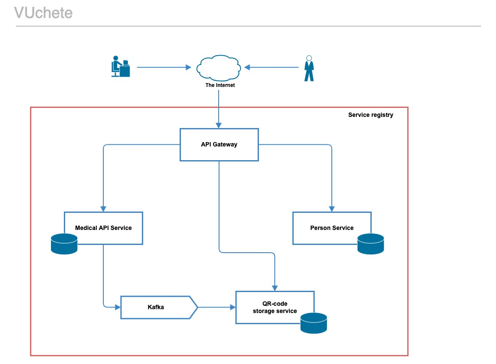

# VUchete
### Схема проекта:


Компоненты системы:
- Person Service - микросервис ответственный за работу с пользователями системы.
- Medical API Service - микросервис для интеграции с пунктами вакцинации.
- QR-code storage service - сервис для генерации и персистентного хранения QR кодов пользователей.
- API Gateway - ответственнен за маршрутизацию запросов поступающих в систему
- Все сервисы зарегистрированы в service registry.

### Начало работы
В консоли прописать команду (для этого требуется установленный докер):
```
docker-compose up -d
```

Swagger: http://localhost/webjars/swagger-ui/index.html
